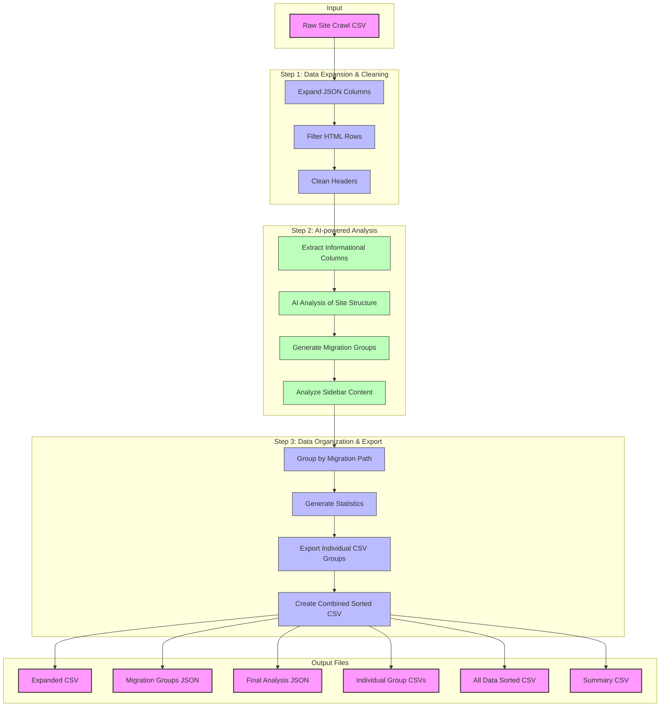

# AI-powered Migration Tools

## ✨ Description
This repository outlines processes and includes tools used for interpreting data generated from site crawls to inform content migrations. The tools are designed to assist with data migration, data cleaning, and AI-fueled data analysis tasks. The goal is to apply data-based decisions to consolidating the migration of multiple sites.

## 🚀 Features
- Uses `uv` for fast dependency management and isolated execution
- Built with `polars`, `google-genai`, and `python-dotenv`
- Modular script structure runnable via module syntax
- **Crawl Analysis**: Analyze and extract insights from crawled datasets.
- **Deduplication**: Remove duplicate items from columns to ensure data integrity.
- **JSON Expansion**: Expand JSON fields within CSV files into separate columns for easier analysis.
- **Header Cleaning**: Standardize and clean column headers in tabular data.
- **HTML Row Filtering**: Filter out unwanted HTML rows from datasets.
- **AI Integration**: Utilities for making AI calls to enhance or validate data.

## 🔄 Workflow

A visualization of the project's data processing workflow:



## 📦 Requirements

- Python **3.13+**
- [`uv`](https://docs.astral.sh/uv/) (a modern Python package manager)

- Install `uv` (if you don’t already have it)
``` bash
    curl -LsSf https://astral.sh/uv/install.sh | sh
    # or
    pipx install uv
    # or
    pip install uv
    # or
    brew install uv
```

For more options, review the [Documentation for installing uv](https://docs.astral.sh/uv/getting-started/installation/)


## 🔧 Getting Started
1. **Clone the repository**:
```bash
    git clone https://github.com/civicactions/ai-migrations.git
    cd ai-migrations
```

1. **Install dependencies**:
   - Install the required python version in a virtual env:
   ```bash
   uv venv --python 3.13.0
   ```
   - Install other dependencies directly from `pyproject.toml`:
   ```bash
   uv pip install -r pyproject.toml
   ```

## How to run the crawl analysis:
There are 2 options for running the crawl analysis. It can be run as an app on the browser our with Python scripts in the command line.

### Running the analysis on the browser:
The app provides a visual interface for uploading a CSV file generated from a site crawl. It runs the analysis and provides CSV file downloads of the analyzed and grouped urls.

**Local development**
In the command line, run the following:
1. Initialize packages
  ```bash
   uv sync
  ```
2. Start the app:
  ```bash
   python -m streamlit run ai_crawl_analysis/streamlit_app.py
   - OR -
   uv run -m streamlit run ai_crawl_analysis/streamlit_app.py
   ```
This will open the app in http://localhost:8501/.
Upload a CSV file to the upload field to start the analysis.

**Cloud environment**
URL - This is TBD & will be updated when this gets deployed.
When this is deployed to the cloud, upload a CSV file to start the analysis.


### Running the analysis in the command line:
The Python scripts provide a more granular method for executing the analysis. You can run all the steps or run individual steps for better control and debugging.

The processing scripts are structured as modules. You can
- Run them using uv run or standard Python module syntax
   ```bash
   uv run -m ai_crawl_analysis.main [path_to_crawl_file] (eg. data/audit-inputs/sample-seed-fund.csv)
   ```
- Run individual scripts with these commands:
   ```bash
     uv run -m ai_crawl_analysis.expand_json_csv
     uv run -m ai_crawl_analysis.deduplicate_column_items
     uv run -m ai_crawl_analysis.crawl_analysis
**OR**

- Run them using Python directly
  - Activate the virtual environment
  - Then run `python -m ai_crawl_analysis.main`


### Environment variables
The crawl_analysis script requires an API_KEY environment variable. Edit the env.example field at the root of the project to add your AI API Key.

## License

MIT License
