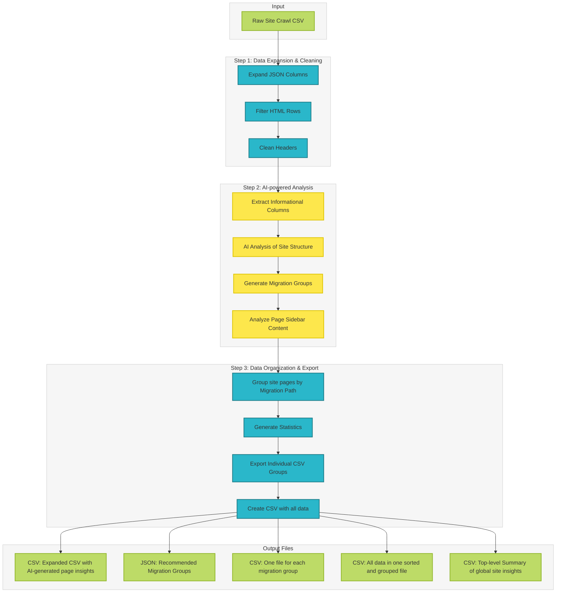

# AI-enhanced site crawl analysis

## ✨ Description
The AI crawl analysis tool is a set of utilities that together, interprets data generated from site crawls to inform content migrations. The tool enhances traditional site crawl analysis by gathering additional context about a site’s pages during site crawls. It performs further analysis on the extracted data to provide relevant content insights. The goal is to efficiently and quickly gather site information and apply data-based decisions to site migrations.

## 🚀 Features
- **Crawl Analysis**: Analyze and extract insights from crawled datasets.
- **Deduplication**: Remove duplicate items from columns to ensure data integrity.
- **Header Cleaning**: Standardize and clean crawl column headers in tabular data.
- **HTML Row Filtering**: Filter out unwanted HTML rows from datasets.
- **AI Integration**: Uses AI prompts during and after crawl analysis to enhance and validate crawl data.

## 📦 Requirements

- Python **3.13+**
- [`uv`](https://docs.astral.sh/uv/) (a modern Python package manager)

- Install `uv` (if you don’t already have it)
``` bash
    curl -LsSf https://astral.sh/uv/install.sh | sh
    # or
    pipx install uv
    # or
    pip install uv
    # or
    brew install uv
```

For more options, review the [Documentation for installing uv](https://docs.astral.sh/uv/getting-started/installation/)


## 🔧 Getting Started
### 1. Set up development environment
- **Clone the repository**:
```bash
    git clone https://github.com/civicactions/ai-migrations.git
    cd ai-migrations
```

- **Install dependencies**:
   - Install the required python version in a virtual env:
   ```bash
   uv venv --python 3.13.0
   ```
   - Install other dependencies directly from `pyproject.toml`:
   ```bash
   uv pip install -r pyproject.toml
   ```

### 2. Set up site crawls to return the expected CSV for the analysis:
The assumption for using this tool is that there is a CSV file, generated from a site crawl to analyze. This site crawl file needs to have at least 2 columns, an 'address' column that lists the page urls and a column with AI-generated insights. The default name for the AI-generated column is "Gemini: JSON schema v5" but it can be changed in [the CSV expansion script](ai_crawl_analysis/expand_json_csv.py).

For an example of running a site crawl using AI to generate additional page insights review the [Screaming Frog setup with Gemini](docs/screaming-frog-ai-setup.md) documentation.

### 3. Run the crawl analysis:
There are 2 options for running the crawl analysis. It can be run as an app on the browser or with Python scripts in the command line.

#### Running the analysis on the browser:
The app provides a visual interface for uploading a CSV file generated from a site crawl. It runs the analysis and provides CSV file downloads of the analyzed and grouped urls.

**Local development**
In the command line, run the following:
1. Initialize packages
  ```bash
   uv sync
  ```
2. Start the app:
  ```bash
   python -m streamlit run ai_crawl_analysis/streamlit_app.py
   - OR -
   uv run -m streamlit run ai_crawl_analysis/streamlit_app.py
   ```
This will open the app in http://localhost:8501/.
Upload a CSV file to the upload field to start the analysis.

**Cloud environment**
(This is TBD & will be updated when the tool gets deployed.)
When this is deployed to the cloud, upload a CSV file to start the analysis.


#### Running the analysis in the command line:
The Python scripts provide a more granular method for executing the analysis. You can run all the steps or run individual steps for better control and debugging.

The processing scripts are structured as modules. You can
- Run them using uv run or standard Python module syntax
   ```bash
   uv run -m ai_crawl_analysis.main [path_to_crawl_file] (eg. data/audit-inputs/sample-seed-fund.csv)
   ```
- Run individual scripts with these commands:
   ```bash
     uv run -m ai_crawl_analysis.expand_json_csv
     uv run -m ai_crawl_analysis.deduplicate_column_items
     uv run -m ai_crawl_analysis.crawl_analysis
  ```
**OR**

- Run them using Python directly
  - Activate the virtual environment
  - Then run `python -m ai_crawl_analysis.main`


### Environment variables
The crawl_analysis script requires an API_KEY environment variable. Edit the env.example field at the root of the project to add your AI API Key.


## 🔄 Data processing workflow

A visualization of the project's data processing workflow:




## License

MIT License
