# AI Migrations Data Processing Workflow

This diagram visualizes the complete data processing pipeline for the AI-assisted website migration analysis project.

```mermaid
flowchart TD
    %% Main Pipeline Flow
    Input["`**Raw Crawl Data**
    (Screaming Frog export)`"] --> Main{"`**main.py**
    🚀 Pipeline Orchestrator`"}
    
    %% Step 1: JSON Expansion
    Main --> Step1["`**Step 1: expand_json_csv.py**
    📊 JSON Column Expansion
    - Parse JSON in CSV columns
    - Flatten nested structures
    - Clean headers`"]
    
    Step1--> ExpandedCSV["`**Expanded CSV**
    Generates additional CSV columns for AI-generated insights
    Saved in 📋 *-expanded.csv
    (audit-outputs/)`"]
    
    %% Step 2: AI Analysis
    ExpandedCSV --> Step2["`**Step 2: crawl_analysis.py**
    🤖 AI-Powered Analysis`"]
    
    Step2 --> Extract["`**extract_cols_to_json**
    🔍 Column Extraction
    - address
    - page_description
    - page_structure
    - sidebar
    - sidebar_has_menu`"]
    
    Extract --> ExtractedJSON["`**Extracted Columns**
    📝 extracted_columns.json
    (audit-outputs/)`"]
    
    %% AI Processing Chain
    ExtractedJSON --> AI1["`**AI Call #1**
    🧠 Migration Groups
    Prompt: migration_group_prompt.txt
    Schema: migration_group_schema.json`"]
    
    AI1 --> RawGroups["`**Raw AI Response**
    📄 migration_groups.json
    (May contain code fences)`"]
    
    RawGroups --> JSONCleaner["`**json_cleaner.py**
    🧹 Content Cleaning
    - Remove code fences
    - Extract JSON array
    - Fix incomplete objects
    - Ensure proper structure`"]
    
    JSONCleaner --> CleanGroups["`**Clean Migration Groups**
    ✅ migration_groups.json
    (crawl-analysis/)`"]
    
    CleanGroups --> AI2["`**AI Call #2**
    🧠 Sidebar Analysis
    Prompt: migration_group_with_sidebar_prompt.txt
    Schema: migration_group_with_sidebar_schema.json`"]
    
    AI2 --> FinalOutput["`**Final Analysis Output**
    📊 final-analysis-output.json
    (crawl-analysis/)`"]
    
    %% Step 3: Grouping and Export
    FinalOutput --> Step3["`**Step 3: grouped_migration_paths.py**
    📈 Data Grouping & Export`"]
    
    Step3 --> GroupProcessing["`**Group Processing**
    🔄 Data analysis operations
    - Group by migration_group
    - Generate statistics
    - Create group dictionaries`"]
    
    GroupProcessing --> Exports["`**Multiple Exports**
    📂 migration_groups/`"]
    
    %% Output Files
    Exports --> CSV1["`**Group CSVs**
    📋 Homepage.csv
    📋 Standard_Page.csv
    📋 Landing_Page.csv
    📋 etc.`"]
    
    Exports --> CSV2["`**Summary Files**
    📊 all_data.csv
    📊 summary.csv
    📄 all_data.json`"]
    
    %% Styling
    classDef inputStyle fill:#BDDB67,stroke:#91B62B,stroke-width:2px
    classDef processStyle fill:#2AB7CA,stroke:#1c7b87,stroke-width:2px
    classDef outputStyle fill:#FB5F2E,stroke:#dc3704,stroke-width:2px
    classDef aiStyle fill:#FDE74C,stroke:#dec402,stroke-width:2px
    
    class Input,ExpandedCSV,ExtractedJSON,RawGroups,CleanGroups,FinalOutput inputStyle
    class Main,Step1,Step2,Step3,Extract,JSONCleaner,GroupProcessing,Exports processStyle
    class CSV1,CSV2 outputStyle
    class AI1,AI2,AICall aiStyle

    %% Legend / Key for colors
    subgraph Legend [Legend — Color Key]
      direction LR
      LegendInput["Input: Raw inputs & files"]
      LegendProcess["Process: Data processing steps"]
      LegendOutput["Output: Final exports & reports"]
      LegendAI["AI: LLM calls & AI utilities"]
    end

    class LegendInput inputStyle
    class LegendProcess processStyle
    class LegendOutput outputStyle
    class LegendAI aiStyle
```



## Key Features

### 🔄 **Pipeline Stages**
1. **JSON Expansion**: Flatten complex JSON structures in CSV columns
2. **AI Analysis**: Two-phase AI processing for content categorization
3. **Data Grouping**: Statistical analysis and export to multiple formats

### 🧹 **JSON Cleaning Process**
- Removes LLM-generated code fences (````json```)
- Extracts pure JSON content from mixed text
- Fixes incomplete/cut-off objects
- Ensures valid JSON structure

### 🤖 **AI Integration**
- **Phase 1**: Migration group classification using content analysis
- **Phase 2**: Sidebar analysis for enhanced categorization
- Uses structured prompts and JSON schemas for consistent output

### 📊 **Output Formats**
- Individual CSV files per migration group
- Summary statistics and aggregated data
- JSON format for programmatic access
- Comprehensive logging and error handling

### ⚙️ **Configurable Options**
- Skip pipeline steps for partial processing
- Customizable output directories
- Extensible prompt and schema system
- Robust error handling and validation
