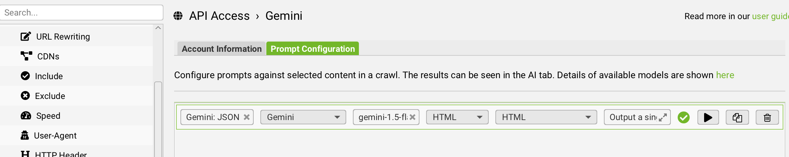

# How to run site crawls with Gemini in the Screaming Frog SEO Spider tool

To download and install Screaming frog, go to https://www.screamingfrog.co.uk/seo-spider/
Assumption: You have already set up the Screaming Frog app and can run Screaming Frog audits locally.

- Add the Gemini API key to Config → API Access → Gemini → Account information. Set the Account type to paid.
- Under prompt configuration (Config → API Access → Gemini → Prompt Configuration), add a new prompt.

  

Values:
  - Name: Gemini: JSON schema v5 (This column name used in the crawl analysis but can be changed in the [JSON expansion script](../ai_crawl_analysis/expand_json_csv.py))
  - Model category: Gemini
  - Model name: [your Gemini model name]
  - Content type to run urls on: HTML
  - Text to run prompt on: HTML
  - Prompt: Copy and paste the [Screaming AI prompt](prompts/screaming-frog-prompt.txt)
  - Optional: It’s helpful to add this config to the prompt library. Otherwise, it can get wiped when the app restarts.

